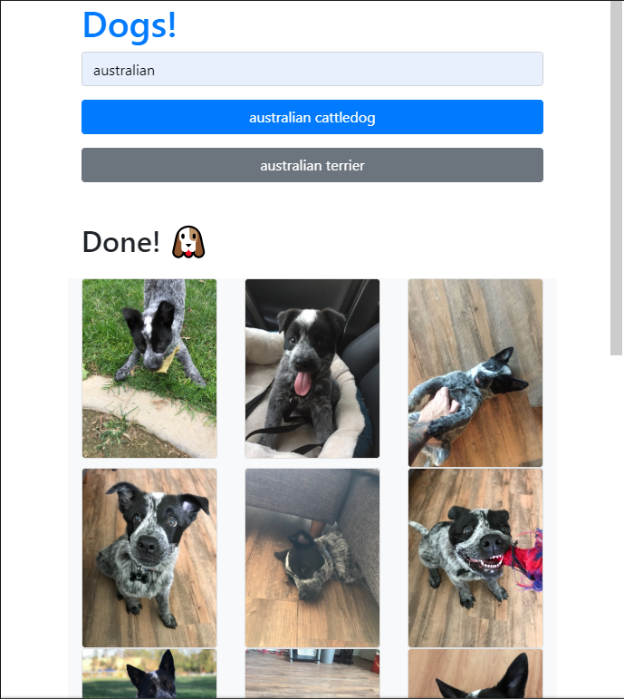
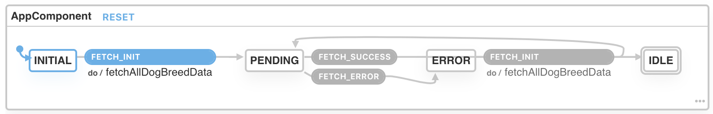
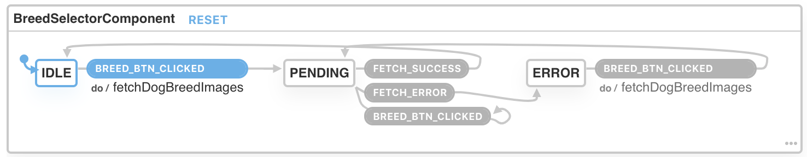
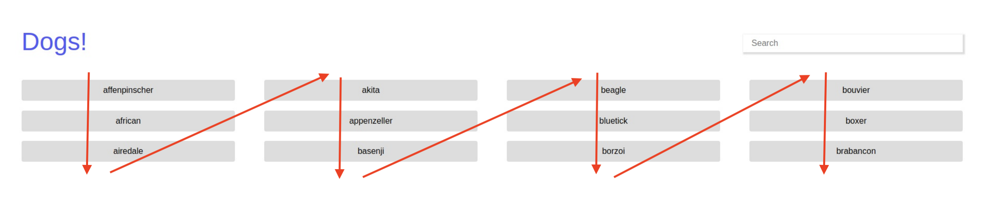

# Dog Search

This is a single-page application to search for photos of nice doggies. 🐶



Also, it provided me with the opportunity to practice working with [TypeScript + React](https://reactjs.org/docs/static-type-checking.html#typescript)!

---

## Specifications

This application was built according to the following specifications:

> Create a single-page application that allows a user to:
>
> - Search for a specific breed of dog and display a list of the first 12 matching results, sorted
>   alphabetically.
>   - If the search field is empty, display a list of the first 12 breeds available, sorted alphabetically.
>   - If the search field does not match any breeds, display a message that no breeds were found.
>   - While the list of breeds is loading, display a message that the breeds are loading.
> - Select one of the matching results and view pictures of that breed.
>   - When a result is selected, mark the selection visually as being active.
>   - While the images of the selected breed are loading, display a message that the images are loading.
>   - Use the Dog API (https://dog.ceo/dog-api/) as your data source.

---

## Implementation

### Finite State Machines

The logic for this user interface is built using **reducers** that act explicitly as **finite state machines**. That is, the reducer uses the current state and current action to determine which is the next state it should transition, and side-effects are run _only_ when transitions between certain states have occurred.

Modeling the application with state machines will make easier to support extensibility in the long term, since it precisely defines when side-effects should be executed.

See the following state machines as interactive visualizations:

- [Click here](https://xstate.js.org/viz/?gist=464b097c1f2061d8ccde857f1fd060ce) to interact with the `App` Component's state machine visualization.
  

- [Click here](https://xstate.js.org/viz/?gist=862063fd29ac5959193d07758e32cfc9) to interact with the `BreedSelector` Component's state machine visualization.
  

### TypeScript Types

One goal I had was to create Types for the various states of the Finite State Machine (FSM), as well as the Actions that cause the FSM to transition. Redux's documentation on TypeScript does [describe an approach](https://redux.js.org/recipes/usage-with-typescript) of creating Actions using string literals, which would have sufficed.

However, one missing piece with this approach was a parent object that could contain references to all those string literals. This single object can make exporting less tedious and also provide helpful auto-complete:

```
const ALL_FSM_STATES = {
    STATE_1: "STATE_1",
    STATE_2: "STATE_2",
    // ... Additional States
};
// Typing this below: "ALL_FSM_STATES."
// and then prompting autocomplete would show the list of state names
// ALL_FSM_STATES.STATE_1
// ALL_FSM_STATES.STATE_2
```

Luckily, I eventually found a [description of a utility function](https://basarat.gitbooks.io/typescript/docs/types/literal-types.html) that accomplished this goal! So thus, this project has the following approach to Types:

```
/** Create parent object using utility function. */
const Direction = strEnum(['North', 'South', 'East','West']);

/** Create a Type from the parent object */
type Direction = keyof typeof Direction;

// Here, the Direction object can provide autocomplete behavior,
// and the Direction Type can provide type-safety!
```

### User Interface Layout

The UI screenshots provided by the specification show that the buttons are laid out in grid of three rows, four columns each.

Additionally, I noted the data in this grid flows down each column from top-to-bottom _first_, and then wraps left-to-right.
I have annotated the provided screenshot to better illustrate this flow of data:


I did implement the project as described in the screenshot, but personally I prefer a left-to-right layout over a zig-zag layout, since the former is a closer experience to reading text.

In a team setting, I would voice my concerns and work together with the designer to make sure the interface is as intuitive as possible.

### Mobile

The specification provided UI mocks for a desktop viewport, but did not indicate how the design should change for mobile devices.
I consolidated the elements into a single-column layout, although the challenge here is still in how to present a list of available options (button grid) while simultaneously showing the query results (image grid).
I placed a maximum-height limit on the button-grid to ensure the results are at least visible to the user.

### Sub-breed Search

While not mentioned in the specification, this application supports search by sub-breed (e.g. boston bulldog, english bulldog, french bulldog).

### Future Improvements

The Dog API sends back well over a hundred images for a request to its breed endpoint.
It did not make sense to me to display that many images at once for the user, so I set a cut off of 51 images (17 rows, with 3 images per row).
A future improvement here could be a "lazyload" feature, which is when the user's scroll to the bottom of the screen prompts the application to display additional images.

---

## Technologies

- TypeScript

  The sourcecode for this application has been in [TypeScript](https://www.typescriptlang.org/), allowing for errors to be caught at build time.

- React

  This application is built using React, a library for building user interfaces. In particular, this project was bootstrapped with [Create React App](https://github.com/facebook/create-react-app).

  In addition, the sourcecode for this application makes use of Hooks, a new(ish) feature of React.
  `useReducer` hooks are used to organize the logic for changes to application state, and `useEffect` is employed to retrieve API data.

- Bootstrap

  This application relies on [Bootstrap (v4)](https://getbootstrap.com/), an opensource CSS library.

- Dog API

  The [Dog API](https://github.com/ElliottLandsborough/dog-ceo-api) hosts the data and images queried by this application.

---

## Running the Application

This application has been bootstrapped with [`create-react-app`](https://facebook.github.io/create-react-app/).

To run this application in a local development environment, Node 8.10.0 or later is required.

To install the application's dependencies, navigate to the the project directory in a terminal, and run the command: `npm install`

### Development

Once the installation is complete, you can run: `npm start`

This command runs the app in the development mode.<br>
Open [http://localhost:3000](http://localhost:3000) to view it in the browser.

### Production

To view this application as it would run in a production environment, the recommended approach would be to generate a production build and use a static server (like [serve](https://github.com/zeit/serve)) to view it.

```
npm run build
npm install -g serve
serve -s build
```
